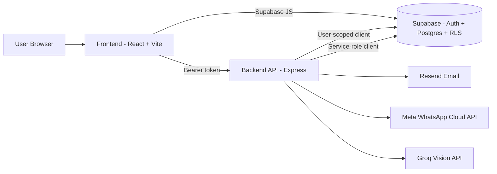

# Kharcha Tracker

Kharcha Tracker is a full-stack, multi-workspace expense tracker with authentication, budget thresholds, in-app budget banners, and optional email/WhatsApp alert channels.

This repository is currently on the Supabase-based architecture (v2). The old local JSON flow has been replaced with authenticated data access and workspace-aware features.

## Table of Contents

1. Overview
2. Features
3. Architecture
4. Tech Stack
5. Project Structure
6. Prerequisites
7. Environment Setup
8. Installation
9. Running the App
10. Scripts
11. API Reference
12. Data Model
13. Alert System Behavior
14. Receipt OCR
15. Migration Notes
16. Troubleshooting
17. Security Notes

## Overview

Kharcha Tracker helps users:

- Create accounts and sign in.
- Work inside one or more workspaces.
- Add and delete expenses with category mapping.
- Monitor budget utilization per category and workspace.
- Receive threshold alerts (80%, 90%, 100%) as in-app banners and optional email/WhatsApp notifications.
- Scan receipt images and prefill expense fields using Groq Vision.

## Features

- Email/password authentication via Supabase Auth.
- Workspace membership and role support (owner/member).
- Per-category and workspace-level monthly budgets.
- Threshold alert engine with deduped alert logs.
- Expense list with optimistic add/delete updates using TanStack Query.
- Soft delete for expenses.
- Dashboard stats and visualizations.
- Invite flow and owner-level member management route.
- Optional channels:
	- Email alerts via Resend.
	- WhatsApp alerts via Meta Cloud API (feature-flagged).

## Architecture



## Tech Stack

- Frontend: React 18, Vite 5, Tailwind CSS, TanStack Query, Recharts, Lucide React
- Backend: Node.js, Express 4, Supabase JS, dotenv
- Auth + DB: Supabase Auth + Postgres (with RLS)
- Notifications: Resend (email), Meta WhatsApp Cloud API (optional)
- OCR: Groq API (Llama vision model)

## Project Structure

```text
kharcha-tracker/
|- backend/
|  |- alerts/
|  |  |- alertEngine.js
|  |  |- alertLogger.js
|  |  |- budgetCalculator.js
|  |  \- channels/
|  |     |- emailChannel.js
|  |     \- whatsappChannel.js
|  |- ocr/
|  |  \- receiptScanner.js
|  |- server.js
|  \- package.json
|- frontend/
|  |- src/
|  |  |- components/
|  |  |- context/
|  |  |- hooks/
|  |  |- pages/
|  |  |- api.js
|  |  |- App.jsx
|  |  \- lib/supabase.js
|  |- vite.config.js
|  \- package.json
|- migrate-to-supabase.js
|- MIGRATION-GUIDE.md
|- START HERE.bat
|- start-backend.bat
\- start-frontend.bat
```

## Prerequisites

- Node.js 18+
- npm 9+
- A Supabase project with schema and RLS configured

Optional (for full integrations):

- Resend account and API key
- Meta WhatsApp Cloud API credentials
- Groq API key

## Environment Setup

Create two env files.

### 1) Backend env file

Path: `.env.backend`

```bash
# Required
SUPABASE_URL=https://YOUR_PROJECT.supabase.co
SUPABASE_ANON_KEY=YOUR_SUPABASE_ANON_KEY
SUPABASE_SERVICE_ROLE_KEY=YOUR_SUPABASE_SERVICE_ROLE_KEY

# Optional
PORT=5000
APP_URL=http://localhost:5173

# Email channel (optional)
RESEND_API_KEY=YOUR_RESEND_API_KEY
RESEND_FROM_EMAIL=onboarding@resend.dev

# WhatsApp channel (optional, feature-flagged)
WHATSAPP_ENABLED=false
META_WHATSAPP_TOKEN=
META_PHONE_NUMBER_ID=
META_TEMPLATE_NAME=budget_alert

# OCR (optional)
GROQ_API_KEY=
```

### 2) Frontend env file

Path: `frontend/.env`

```bash
VITE_SUPABASE_URL=https://YOUR_PROJECT.supabase.co
VITE_SUPABASE_ANON_KEY=YOUR_SUPABASE_ANON_KEY
```

## Installation

From repository root:

```bash
npm run install:all
```

Or manually:

```bash
cd backend
npm install
```

```bash
cd frontend
npm install
```

## Running the App

### Standard development flow

Terminal 1:

```bash
cd backend
npm run dev
```

Terminal 2:

```bash
cd frontend
npm run dev
```

Open: `http://localhost:5173`

### Windows launcher scripts

- `START HERE.bat`: starts backend and frontend in separate terminals, then opens browser.
- `start-backend.bat`: starts only backend.
- `start-frontend.bat`: starts only frontend.

### Ports

- Frontend: `5173`
- Backend: `5000`

## Scripts

### Root

- `npm run install:all` - install backend and frontend dependencies
- `npm run backend` - start backend in dev mode
- `npm run frontend` - start frontend in dev mode
- `npm run migrate` - run migration script

### Backend

- `npm run dev` - start with nodemon
- `npm start` - start with node
- `npm run migrate` - run root migration script

### Frontend

- `npm run dev` - Vite dev server
- `npm run build` - production build
- `npm run preview` - preview production build

## API Reference

All `/api/*` endpoints require `Authorization: Bearer <supabase_access_token>` except `/health`.

### Health

- `GET /health`

### Stats and budgets

- `GET /api/stats?workspace_id=<uuid>`
- `GET /api/budget-status?workspace_id=<uuid>&month=YYYY-MM`

### Expenses

- `POST /api/expenses`
	- Body: `workspace_id`, `category_id`, `title`, `amount`, `date`
- `DELETE /api/expenses/:id`
	- Soft-deletes expense (`deleted_at`)

### Alerts

- `GET /api/alert-logs?workspace_id=<uuid>&month=YYYY-MM`
- `DELETE /api/alert-logs`
	- Body: `workspace_id`, `month`, optional `category_id`

### Collaboration

- `POST /api/invite`
	- Body: `workspace_id`, `email`
- `DELETE /api/workspace/:workspaceId/members/:userId`
	- Owner-only member removal with last-owner guard

### Receipt OCR

- `POST /api/scan-receipt`
	- Body: `image` (data URI), optional `categories[]`

## Data Model

Core tables used by application logic:

- `workspaces`
- `workspace_members`
- `categories`
- `expenses`
- `budgets`
- `alert_logs`
- `profiles` (for WhatsApp numbers)

Important behavior:

- Expenses are soft-deleted using `deleted_at`.
- Budget scope can be:
	- Workspace-level (`category_id = null`)
	- Category-level (`category_id = category uuid`)
- Alert dedupe is based on workspace, category scope, month, and threshold.

## Alert System Behavior

Thresholds: `80`, `90`, `100`.

Flow after adding expense:

1. Backend inserts expense.
2. Alert engine evaluates category and workspace budgets in parallel.
3. Newly crossed thresholds are detected.
4. Channels are attempted (email/WhatsApp).
5. Alert event is written to `alert_logs`.
6. Frontend renders highest alert per scope in the `BudgetBanner` UI.

When budget is updated, stale alert logs are cleared for that workspace and month so outdated banners do not persist.

## Receipt OCR

Receipt parsing endpoint:

- Validates image type (`jpeg`, `png`, `webp`) and size.
- Sends data URI to Groq vision model.
- Parses strict JSON response.
- Maps extracted category to known workspace categories.

Returned fields:

- `amount`
- `category`
- `vendor`
- `date`

## Migration Notes

If you are migrating from local JSON (`backend/db.json`) to Supabase, use:

- `migrate-to-supabase.js`
- `MIGRATION-GUIDE.md`

The migration script creates/uses a migration user, maps old categories to category IDs, and inserts historical expenses into Supabase.

## Troubleshooting

### Backend exits immediately

Common causes:

- Missing `SUPABASE_URL` or `SUPABASE_ANON_KEY` in `.env.backend`
- Invalid env values
- Dependencies not installed in `backend/`

Check:

```bash
cd backend
npm install
npm run dev
```

### Frontend exits immediately

Common causes:

- Missing `VITE_SUPABASE_URL` or `VITE_SUPABASE_ANON_KEY` in `frontend/.env`
- Dependencies not installed in `frontend/`

Check:

```bash
cd frontend
npm install
npm run dev
```

### Budget warning banner does not clear after budget update

The app clears stale monthly alert logs after budget changes. If old logs still appear, refresh dashboard data and ensure backend API is running with valid auth.

### Invite route returns 503

`SUPABASE_SERVICE_ROLE_KEY` is likely missing. Owner/admin routes require service-role client initialization.

### OCR endpoint fails

Ensure `GROQ_API_KEY` is configured and image size/type is valid.

## Security Notes

- Never commit `.env` files.
- Treat `SUPABASE_SERVICE_ROLE_KEY`, `RESEND_API_KEY`, `META_WHATSAPP_TOKEN`, and `GROQ_API_KEY` as secrets.
- Keep `WHATSAPP_ENABLED=false` until your template is approved and tested.
- RLS remains active for user-scoped operations; service-role actions are limited to backend-only routes.
